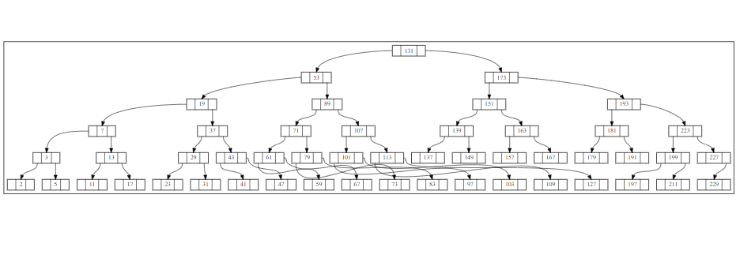

# Week 11 - Binary Trees

## Team

>Members:
>
>- Mārtiņš Dāvis Bernhards
>- Damīrs Zaļums
>
> Date: 30 05 2024

## Activities

Make sure to have the activities signed off regularly to ensure progress is tracked.

Download the provided project and open it in CLion.

### Activity 1: Maintaining order in arrays and linked lists - reprise

Record your answer here
|                    |    Array    | Linked List |
| ------------------ | ----------- | ----------- |
| value insertion    | O(logn + n) | O(n + 1)    |
| value removal      | O(logn + n) | O(n + 1)    |
| membership testing | O(logn)     | O(n)        |

### Activity 2: Recognizing BSTs
Is it a binary search tree?
Tree A - no value: 71
Tree B - no value: 84
Tree C - yes

### Activity 3: Searching for values

```c++
bool bintree::contains(int value) const 
{
    if (!m_root) return false;
    const bintree_node *node = m_root;

    while (true)
    {
        if (node->m_value == value)
        {
            return true;
        }
        else if (node->m_value > value)
        {
            if (node->has_left_child())
            {
                node = node->m_left;
            }
            else
            {
                return false;
            }
        }
        else
        {
            if (node->has_right_child())
            {
                node = node->m_right;
            }
            else
            {
                return false;
            }
        }
    }
}
```

### Activity 4: Inserting values

```c++
bool bintree::insert(int value) 
{
    if (m_root == nullptr) 
    {
        m_sentinel.m_left = m_root = new bintree_node{value};
        m_count = 1;

        return true;
    } 
    else 
    {
        bintree_node *node = m_root;
        while (true)
        {
            if (node->m_value == value)
            {
                return false;
            }
            else if (node->m_value > value)
            {
                if (node->has_left_child())
                {
                    node = node->m_left;
                }
                else
                {
                    node->m_left = new bintree_node{value};
                    m_count++;
                    return true;
                }
            }
            else
            {
                if (node->has_right_child())
                {
                    node = node->m_right;
                }
                else
                {
                    node->m_right = new bintree_node{value};
                    m_count++;
                    return true;
                }
            }
        }
    }
}
```

### Activity 5: Removing leafs

```c++
void bintree::remove_leaf(bintree_node *node, bintree_node *parent) {
    if (!parent->is_child(node)) throw std::invalid_argument("parent is not the parent of the node");

    if (node == m_root) 
    {
        m_root = nullptr;
        m_sentinel.m_left = nullptr;
    } 
    else if (parent->m_left == node)
    {   
        parent->m_left = nullptr;
    }
    else
    {
        parent->m_right = nullptr;
    }

    delete node;
}

void bintree::remove_half_node(bintree_node *node, bintree_node *parent) {
    if (!parent->is_child(node)) throw std::invalid_argument("parent is not the parent of the node");

    bintree_node *tempNode = node->has_right_child() ? node->m_right : node->m_left;

    if (node == m_root) 
    {
        m_root = tempNode;
        m_sentinel.m_left = m_root;
    }
    else
    {
        parent->replace_child(node, tempNode);
    }

    delete node;
}
```

### Activity 6: Moving values around
1.
A, B, C < rootNode < D, E, F, G 
A, B, C <     F    < D, E, G

2.
A, B, C, D, E < rootNode < F, G, H, J
A, B, C, D    <     E    < F, G, H, J
### Activity 7: Finding the smallest and greatest values

```c++
// smallest value
int value1(const bintree_node * root) {
    while (root->has_left_node()) root = root->left();
    return root->value();
}

//biggest value
int value4(const bintree_node * root) {
    while (root->has_right_node()) root = root->right();
    return root->value();
}
```

### Activity 8: Removing full nodes

```c++
void bintree::remove_full_node(bintree_node *node) 
{
    bintree_node *replacementNode = node->m_left;
    bintree_node *parentNode = node;

    while (replacementNode->has_right_child())
    {
        parentNode = replacementNode;
        replacementNode = replacementNode->m_right;
    }

    node->m_value = replacementNode->m_value;
    
    remove_half_node(replacementNode, parentNode);
}

bool bintree::remove(int value) 
{
    bintree_node * parent = &m_sentinel;
    auto node = m_root;

    if (contains(value))
    {
        while (true)
        {
            if (node->m_value == value)
            {
                if (node->is_full())
                {
                    remove_full_node(node);
                }
                else if (node->is_leaf())
                {
                    remove_leaf(node, parent);
                }
                else 
                {
                    remove_half_node(node, parent);
                }

                m_count--;
                return true;
            }
            else if (node->m_value > value)
            {
                parent = node;
                node = node->m_left;
            }
            else
            {
                parent = node;
                node = node->m_right;
            }
        }
    }

    return false;
}
```

### Activity 9: Cleaning up

```c++
void bintree::destruct_subtree(bintree_node *root) 
{
    if (root == nullptr)
    {
        return;
    }

    if (root->has_left_child())
    {
        destruct_subtree(root->m_left);
    }
    
    if (root->has_right_child())
    {
        destruct_subtree(root->m_right);
    }
    
    delete root;
}
```

### Activity 10: (Un)balanced trees



### Activity 11: Time complexity

| Operation | Time complexity (if balanced)   | Time complexity (if unbalanced) |
| --------- | ------------------------------- | ------------------------------- |
| Lookup    |                 O(log n)          |                 O(n)          |
| Insert    |                 O(log n)          |                 O(n)          |
| Remove    |                 O(log n)          |                 O(n)          |

## Looking back

### What we've learnt

Binary search trees

### What were the surprises

:)

### What problems we've encountered

Fill in...

### What was or still is unclear

Fill in...

### How did the group perform?

How was the collaboration? What were the reasons for hick-ups? What worked well? What can be improved next time?
