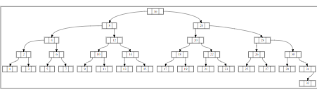
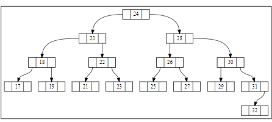

# Week 12 - Balanced Binary Search Trees

## Team

>Members:
>
>- Mārtiņš Dāvis Bernhards
>- Damīrs Zaļums
>
> Date: 03 06 2024

## Activities

Make sure to have the activities signed off regularly to ensure progress is tracked.

Download the provided project and open it in CLion. **NOTE**: in this week you will have to reuse the code of last week. Follow the instructions given in the `main.cpp` file.

### Activity 1: Remembering tree heights

```c++
void bintree_node::update_height() 
{
    int height = 1;

    if (has_left_child())
    {
        height = m_left->m_height + 1;
    }

    if (has_right_child() && height <= m_right->m_height)
    {
        height = m_right->m_height + 1;
    }
    
    m_height = height;
}
```

### Activity 2: Do it yourself: Balance factors

Left tree (Figure 3a):
| Node | Height | Balance factor |
|------|:------:|:--------------:|
| A    |   4    |        1       |
| B    |   2    |       -1       |
| C    |   1    |        0       |
| D    |   3    |       -1       |
| E    |   2    |        0       |
| F    |   1    |        0       |
| G    |   1    |        0       |
| H    |   1    |        0       |

Right tree (Figure 3b):
| Node | Height | Balance factor |
|------|:------:|:--------------:|
| K    |   4    |      -2        |
| L    |   3    |       1        |
| M    |   1    |       0        |
| N    |   2    |       0        |
| P    |   1    |       0        |
| Q    |   1    |       0        |
| R    |   1    |       0        |

Left tree is height balanced

### Activity 3: Computing the balance factor

```c++
int bintree_node::balance_factor() const 
{
    auto right = 0;
    auto left = 0;

    if (has_left_child())
    {
        left = m_left->m_height;
    }

    if (has_right_child())
    {
        right = m_right->m_height;
    }

    return right - left;
}
```

### Activity 4: Implement rotation

```c++
bintree_node *bintree_node::rotate_left() 
{
    if (m_right == nullptr) throw std::invalid_argument("rotate_left: right child is null");
    
    auto new_root = m_right;
    auto leftChild = m_right->m_left;
    
    new_root->m_left = this;
    new_root->m_left->m_right = leftChild;

    update_height();
    new_root->update_height();

    return new_root;
}

bintree_node *bintree_node::rotate_right() 
{
    if (m_left == nullptr) throw std::invalid_argument("rotate_right: left child is null");
    
    auto new_root = m_left;
    auto rightChild = m_left->m_right;
    
    new_root->m_right = this;
    new_root->m_right->m_left = rightChild;

    update_height();
    new_root->update_height();

    return new_root;
}
```

### Activity 5: Left rotations and balance

| B (Balance) | D (Balance) | A Height | C Height | E Height | Balance after rot |
|-------------|:-----------:|:--------:|----------|----------|-------------------|
|   +2        |    -1       |  H       |  H       |  H + 1   |        0          |
|   +2        |     0       |  H       |  H + 1   |  H + 1   |       -1          |
|   +2        |    +1       |  H       |  H + 1   |  H       |       -2          |
|   +2        |    +2       |  H + 1   |  H + 2   |  H       |       -3          |

### Activity 6: Double rotations and balance

| Before rotation | After right-rot | After left-rot |
|-----------------|:---------------:|:--------------:|
|       -1        |        1        |       0        |
|        0        |        1        |       0        |
|       +1        |        2        |       0        |

Code written to create and rotate the trees:

```cpp
void printCnodeBalances(bintree_node* nodeC, bintree_node* root, int treeCount) 
{
    std::cout << "Tree " << treeCount << " C node Balance:" << std::endl;
    std::cout << "Before rotation: "  << nodeC->balance_factor() << std::endl;

    root->replace_child(root->right(), root->right()->rotate_right());

    std::cout << "After right rotation of right subtree: "  << nodeC->balance_factor() << std::endl;

    root = root->rotate_left();

    std::cout << "After left rotation of full: "  << nodeC->balance_factor() << std::endl;
}

int main() 
{
    // Balance factor B =  2
    // Balance factor D = -1

    // Tree one Balance factor C = -1
    bintree_node n1F{'f'}, n1C{'c', &n1F, nullptr}, n1E{'e'}, 
        n1D{'d', &n1C, &n1E}, n1A{'a'}, n1B{'b', &n1A, &n1D};

    printCnodeBalances(&n1C, &n1B, 1);

    // Tree Two Balance factor C = 0
    bintree_node n2F{'f'}, n2G{'g'}, n2C{'c', &n2F, &n2G}, n2E{'e'}, 
        n2D{'d', &n2C, &n2E}, n2A{'a'}, n2B{'b', &n2A, &n2D};

    printCnodeBalances(&n2C, &n2B, 2);

    // Tree Three Balance factor C = 1
    bintree_node n3G{'g'}, n3C{'c', nullptr, &n3G}, n3E{'e'}, 
        n3D{'d', &n3C, &n3E}, n3A{'a'}, n3B{'b', &n3A, &n3D};

    printCnodeBalances(&n3C, &n3B, 3);

    return 0;
}
```

### Activity 7: Rebalancing the tree

```cpp
bintree_node *bintree_node::rebalance() 
{   
    bintree_node* temp = this;
    
    if (balance_factor() > 1)
    {
        if (right()->balance_factor() < 0)
        {
            replace_child(right(), right()->rotate_right());
        }
        
        temp = rotate_left();
    }
    else if (balance_factor() < -1)
    {
        if (left()->balance_factor() > 0)
        {
            replace_child(left(), left()->rotate_left());
        }

        temp = rotate_right();
    }
    
    update_height();
    return temp;
}
```

### Activity 8: Recursive tree traversal

```cpp
void print_tree(const bintree_node* node) 
{
    if (node == nullptr) 
    {
        std::cout << "-";
        return;
    }
    std::cout << node->value();
    print_tree(node->left());
    std::cout << node->value();
}

int main() 
{
    bintree_node 
        nA{1},  
        nB{2, &nA, nullptr}, 
        nC{3, &nB, nullptr}, 
        nD{42}, 
        nE{4, &nC, &nD};

    print_tree(&nE);
    return 0;
}
```

### Activity 9: Insertion and removal

```cpp
bintree_node *bintree::balanced_insert(bintree_node *root, int value) 
{
    if (root == nullptr) 
    {
        m_count++;
        return new bintree_node{value};
    }

    if (root->m_value > value)
    {
        root->m_left = balanced_insert(root->m_left, value);
    }
    else if (root->m_value < value)
    {
        root->m_right = balanced_insert(root->m_right, value);
    }

    return root->rebalance();
}

bintree_node *bintree::balanced_remove(bintree_node *root, int value) 
{
    if (value == root->m_value) 
    {
        if (root->is_full()) 
        {
            int min;
            root->m_right = balanced_remove_minimum(root->m_right, min);
            root->m_value = min;
        }
        else
        {
            m_count--;

            if (root->has_left_child())
            {
                auto temp = root->m_left;
                delete root;
                root = temp;
            }
            else if (root->has_right_child())
            {
                auto temp = root->m_right;
                delete root;
                root = temp;
            }
            else   
            {
                delete root;
                return nullptr;
            }
        }
    }
    else if (value < root->m_value && root->has_left_child()) 
    {
        root->m_left = balanced_remove(root->m_left, value);
    }
    else if (value > root->m_value && root->has_right_child()) 
    {
        root->m_right = balanced_remove(root->m_right, value);
    }

    return root->rebalance();
}
```

### Activity 10: Balanced tree




Code used:

```cpp
int main() 
{
    bintree tree{};

    for (int i = 1; i <= 32; ++i) 
    {
        tree.insert(i);
    }

    bintree_writer::write_dot("treeBefore.dot", tree);

    for (int i = 1; i <= 16; ++i) 
    {
        tree.remove(i);
    }

    bintree_writer::write_dot("treeAfter.dot", tree);

    return 0;
}
```

### Activity 11: Time complexity

Formula for height of the tree: h = log (n+1)

|      Operation      | Time complexity |
| ------------------- | --------------- |
| Value insertion     | O(log n)          |
| Value removal       | O(log n)          |
| Membership testing  | O(log n)          |

## Looking back

### What we've learnt

Balanced binary trees :).

### What were the surprises

Trees can balance them selfs

### What problems we've encountered

Trees talking to us

### What was or still is unclear

How do they talk

### How did the group perform?

Great if trees talking isn't a problem
