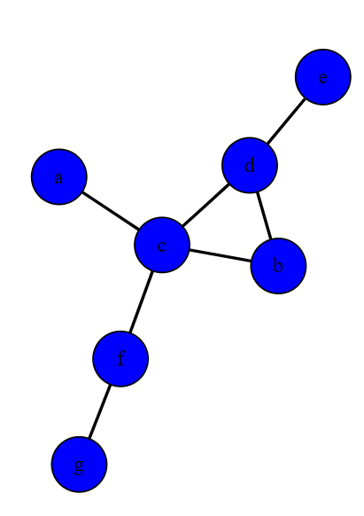
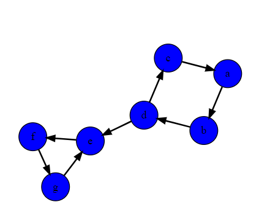
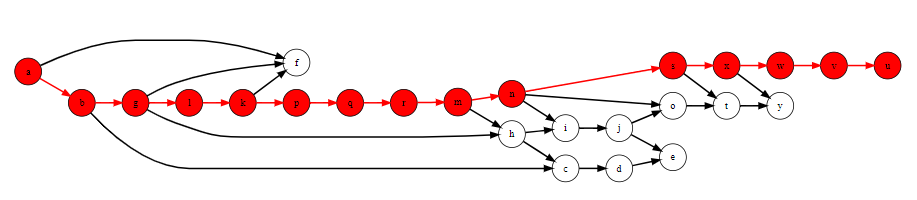
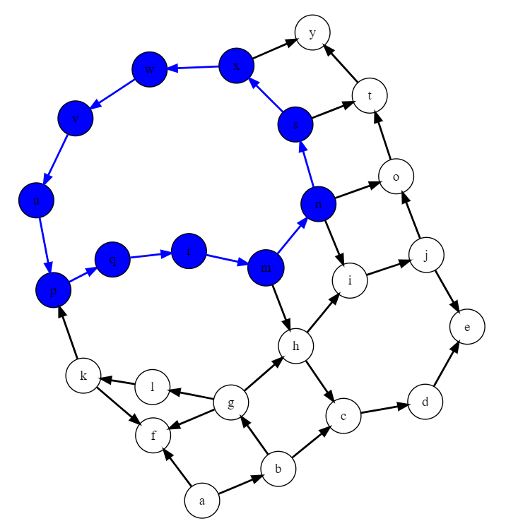

# Week 12 - Graphs

## Team

>Members:
>
>- Mārtiņš Dāvis Bernhards
>- Damīrs Zaļums
>
> Date: 08 06 2023                                                        |      |

## Activities

Make sure to have the activities signed off regularly to ensure progress is tracked.

Download the provided project and open it in CLion. **NOTE**: in this week you will have to reuse the code of last week. Follow the instructions given in the `main.cpp` file.

### Activity 1: Applications of graphs

Directed
Network Routing - Used in network routing algorithms to model the flow of data or resources through a network with specific directional paths.
Dependency Analysis - In software engineering, they are utilized for dependency analysis, where dependencies between components or modules are represented with directional edges.
Social Networks - Can model social networks, where edges represent inherently directional relationships such as following or subscribing.

Undirected
Social Networks - Commonly used to model social networks, where friendships or connections between individuals are inherently bidirectional.
Transportation Networks - Represents transportation networks, where edges represent connections between locations or nodes without specifying a direction of travel.
Wireless Sensor Networks - Used in wireless sensor networks to model bidirectional communication links between sensor nodes.

### Activity 2: Visualizing graphs




### Activity 3: Finding a path

```c++
bool visitor::find_path(const string &start_vertex, const string &goal) 
{
    if (start_vertex == goal)
    {
        return true;
    }

    for (auto& edge : m_graph.find_vertex(start_vertex).edges()) 
    {
        if (find_path(edge.target().name(), goal))
        {
            return true;
        }
    }

    return false;
}
```

### Activity 4: Keeping track of the path

```c++
bool visitor::find_path(const string &start_vertex, const string &goal) 
{
    m_path.push_back(start_vertex);

    if (start_vertex == goal)
    {
        std::string tempVertex;
        for (const auto& vertex_name : m_path) 
        {
            m_graph[vertex_name].set_colour(data::colour::red);

            if (!tempVertex.empty())
            {
                auto& tempEdge = m_graph.find_edge(tempVertex, vertex_name);
                tempEdge.set_colour(data::colour::red);
            }

            tempVertex = vertex_name;
        }

        return true;
    }

    for (auto& edge : m_graph.find_vertex(start_vertex).edges()) 
    {
        if (find_path(edge.target().name(), goal))
        {
            return true;
        }
    }

    m_path.pop_back();
    return false;
}
```



### Activity 5: Keeping track of visited vertices

```c++
bool visitor::find_path(const string &start_vertex, const string &goal) 
{
    m_visited.insert(start_vertex);
    m_path.push_back(start_vertex);

    if (start_vertex == goal)
    {
        std::string tempVertex;
        for (const auto& vertex_name : m_path) 
        {
            m_graph[vertex_name].set_colour(data::colour::red);

            if (!tempVertex.empty())
            {
                auto& tempEdge = m_graph.find_edge(tempVertex, vertex_name);
                tempEdge.set_colour(data::colour::red);
            }

            tempVertex = vertex_name;
        }

        return true;
    }

    for (auto& edge : m_graph.find_vertex(start_vertex).edges()) 
    {
        if (!m_visited.contains(edge.target().name()) && find_path(edge.target().name(), goal))
        {
            return true;
        }
    }

    m_path.pop_back();
    return false;
}
```

### Activity 6: Detecting cycles

```c++
bool visitor::find_path(const string &start_vertex, const string &goal) 
{
    m_visited[start_vertex]++;
    m_path.push_back(start_vertex);

    if (start_vertex == goal)
    {
        std::string tempVertex;
        for (const auto& vertex_name : m_path) 
        {
            m_graph[vertex_name].set_colour(data::colour::red);

            if (!tempVertex.empty())
            {
                auto& tempEdge = m_graph.find_edge(tempVertex, vertex_name);
                tempEdge.set_colour(data::colour::red);
            }

            tempVertex = vertex_name;
        }

        return true;
    }

    for (auto& edge : m_graph.find_vertex(start_vertex).edges()) 
    {
        const auto& vertex = edge.target().name();
        if (m_visited[vertex] == 0 && find_path(vertex, goal))
        {
            return true;
        }
        else if (m_visited[vertex] == 1)
        {
            m_cycle_found = true;
        }
    }

    m_path.pop_back();
    m_visited[start_vertex]--;
    
    return false;
}
```

### Activity 7: Colouring cycles

```c++
bool visitor::find_path(const string &start_vertex, const string &goal) 
{
    m_visited[start_vertex]++;
    m_path.push_back(start_vertex);

    if (start_vertex == goal)
    {
        std::string tempVertex;
        for (const auto& vertex_name : m_path) 
        {
            m_graph[vertex_name].set_colour(data::colour::red);

            if (!tempVertex.empty())
            {
                auto& tempEdge = m_graph.find_edge(tempVertex, vertex_name);
                tempEdge.set_colour(data::colour::red);
            }

            tempVertex = vertex_name;
        }

        return true;
    }

    for (auto& edge : m_graph.find_vertex(start_vertex).edges()) 
    {
        const auto& vertex = edge.target().name();

        if (m_visited[vertex] == 0 && find_path(vertex, goal))
        {
            return true;
        }
        else if (m_visited[vertex] == 1 && !m_cycle_found)
        {
            m_cycle_found = true;
            auto cycleStarted = false;
            std::string tempVertex;

            for (const auto& pathVertex : m_path) 
            {
                if (vertex == pathVertex)
                {
                    cycleStarted = true;
                }
                
                if (cycleStarted)
                {
                    m_graph[pathVertex].set_colour(data::colour::blue);

                    if (!tempVertex.empty())
                    {
                        auto& tempEdge = m_graph.find_edge(tempVertex, pathVertex);
                        tempEdge.set_colour(data::colour::blue);
                    }
                    
                    tempVertex = pathVertex;
                }
            }

            auto& lastEdge = m_graph.find_edge(tempVertex, vertex);
            lastEdge.set_colour(data::colour::blue);
        }
    }

    m_path.pop_back();
    m_visited[start_vertex]--;

    return false;
}
```


### Activity 8: Keeping track of post order

```c++
void topological_sort::dfs(const std::string& vertex) 
{
    m_visited[vertex]++;
    
    for (auto& edge : m_graph.find_vertex(vertex).edges()) 
    {
        auto edgeName = edge.target().name();

        if (m_visited[edgeName] == 0) 
        {
            dfs(edgeName);
        }
        else if (m_visited[edgeName] == 1)
        {
            m_cycle_found = true;
        }
    }
    
    m_visited[vertex]++;
    m_vertices.push_back(vertex);
}
```

### Activity 9: Toplogical sorting

```c++
bool topological_sort::compute() 
{
    m_cycle_found = false;
    m_vertices.clear();
    
    for (const auto& vertex : m_graph.vertices()) 
    {
        auto vertexName = vertex.name();
        
        if (m_visited[vertexName] == 0) 
        {
            dfs(vertexName);
        }
    }
    
    if (m_cycle_found) 
    {
        return false;
    }
    
    std::reverse(m_vertices.begin(), m_vertices.end());
    
    return true;
}
```

### Activity 10: Project scheduling

```c++
int main() 
{
    std::ifstream infile("tasks.txt");

    string line;
    string array[10];

    while(getline(infile, line)) 
    {
        if (line == "\r")
        {
            break;
        }
        
        std::istringstream iss(line);
        string a, b, temp;

        iss >> a >> b;

        while (iss >> temp)
        {
            b += " " + temp;
        }

        a.pop_back();
        array[std::stoi(a) - 1] = b;
    }

    std::ofstream myfile;
    myfile.open ("gameDev.graph");
    myfile << "directed\n";

    while(getline(infile, line)) 
    {
        std::istringstream iss(line);

        string a, b, c, d;
        iss >> a >> b >> c >> d;
        myfile << a << " " << d << std::endl;
    }

    myfile.close();

    auto graph = data::graph::load("gameDev.graph");
    algos::topological_sort sorter{graph};

    if (sorter.compute()) 
    {
        const auto& result = sorter.result();

        std::cout << "Order of tasks:" << std::endl;
        for (const auto& task : result) 
        {
            std::cout << array[std::stoi(task) - 1] << std::endl;
        }
    } 
    else 
    {
        std::cerr << "Cycle there, can't do it." << std::endl;
    }

    return 0;
}
```

## Looking back

### What we've learnt

A lot of good stuff!

### What were the surprises

Can't ruin the surprise by telling

### What problems we've encountered

Don't remember

### What was or still is unclear

Not sure..

### How did the group perform?

Great!! good team work!!!


