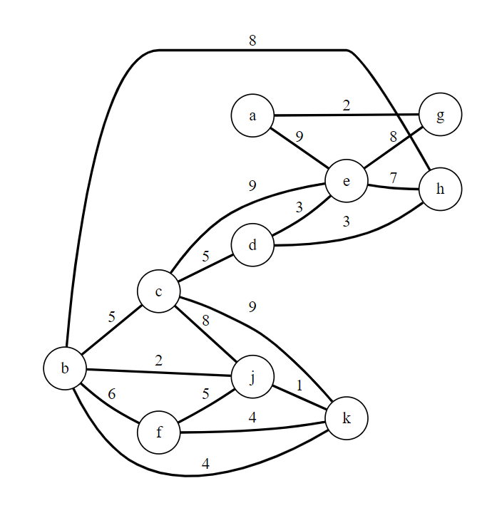
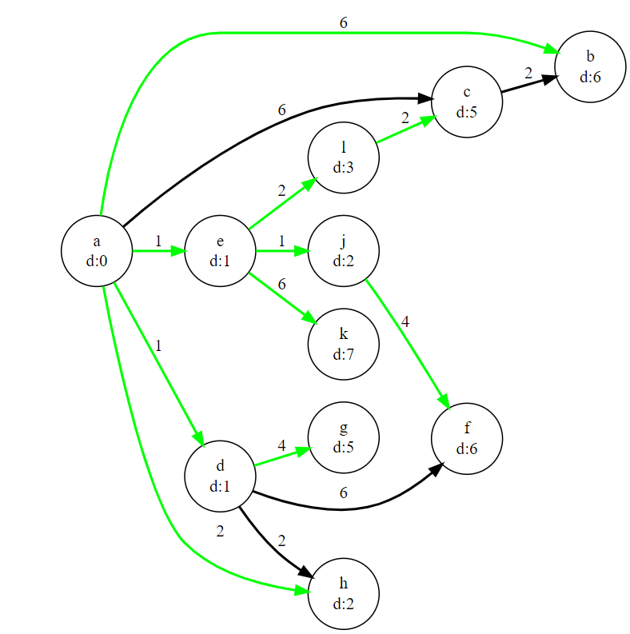
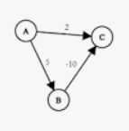

# Week 13 - Shortest Paths

## Team

>Members:
>
>- Mārtiņš Dāvis Bernhards
>- Damīrs Zaļums
>
> Date: 11 06 2023                                                          |      |

## Activities

Make sure to have the activities signed off regularly to ensure progress is tracked.

Download the provided project and open it in CLion. **NOTE**: in this week you will have to reuse the code of last week. Follow the instructions given in the `main.cpp` file.

### Activity 1: Find the shortest distance

Shortest path found is 15
Found it by looking at it and mathing out parts of the whole path

adgklpq - 16
abehlpq - 15

### Activity 2: Depth-first shortest paths

```c++
void sp::sp_dfs::compute(const std::string &start) 
{
    for (auto& edge : m_graph.find_vertex(start).edges()) 
    {
        auto edgeName = edge.target().name();
        auto newDistance = edge.weight() + m_distances[start];
        
        if (newDistance < m_distances[edgeName])
        {
            m_distances[edgeName] = newDistance;
            m_predecessors[edgeName] = start;

            compute(edgeName);
        }
    }
}


```

### Activity 3: Time to relax

```c++
void relaxer::scan_vertex(const std::string &vertex) 
{
    for (auto& edge : m_graph.find_vertex(vertex).edges()) 
    {
        auto edgeName = edge.target().name();
        
        if (relax_edge(vertex, edgeName))
        {
            m_predecessors[edgeName] = vertex;
        }
    }
}

bool relaxer::relax_edge(const std::string &from, const std::string &to) 
{
    auto newDistance = m_graph.find_edge(from, to).weight() + m_distances[from];
    
    if (newDistance < m_distances[to])
    {
        m_distances[to] = newDistance;

        return true;
    }
    
    return false;
}
```

### Activity 4: Depth-first traversal in undirected graphs

```c++
void topological_sort::dfs(const std::string &start, const std::string &previous) 
{
    m_visits[start]++;
    
    for (auto& edge : m_graph.find_vertex(start).edges()) 
    {
        auto edgeName = edge.target().name();

        if (m_visits[edgeName] == 0) 
        {
            dfs(edgeName, start);
        }
        else if (m_visits[edgeName] == 1 && edgeName != previous)
        {
            m_cyclic = true;
        }
    }
    
    m_visits[start]++;
    m_post_visited.push_back(start);
}
```

### Activity 5: Shortest paths in acyclic graphs

```c++
void shortest_paths::compute(const std::string &source, algorithm algo) 
{
    m_predecessors.clear();
    for (const auto& v : m_graph.vertices()) m_distances[v.name()] = VERY_FAR;
    m_distances[source] = 0;
    
    sp::relaxer relaxer{m_graph, m_distances, m_predecessors};

    topological_sort topSort(m_graph);
    topSort.compute(source);

    if (!topSort.is_cyclic()) 
    {
        for (const auto& vertex : topSort.topological_order()) 
        {
            relaxer.scan_vertex(vertex);
        }
    } 
    else 
    {
        if (algo == algorithm::dfs) 
        {
            sp::sp_dfs dfs(m_graph, m_distances, m_predecessors);
            dfs.compute(source);
        }
    }

    colour_paths(data::colour::green);
    label_distances();
}


```

### Activity 6: Dijkstra using linear search

```c++
void sp::dijkstra_simple::compute() 
{
    std::unordered_set<std::string> hashSet;

    while (true)
    {
        int minimumDistance;
        std::string startVertex;

        for (auto& vertex: m_graph.vertices()) 
        {
            auto vertexName = vertex.name();
            auto distance = m_distances[vertexName];

            if ((startVertex == "" || minimumDistance >= distance) && !hashSet.contains(vertexName))
            {
                minimumDistance = distance;
                startVertex = vertexName;
            }
        }

        if (startVertex == "")
        {
            return;
        }

        hashSet.insert(startVertex);
        m_relaxer.scan_vertex(startVertex);
    }
}
```

### Activity 7: Time complexity of Dijkstra - linear search

To find the next vertex to visit: O(n^2)
To update the distance of a vertex: O(m)
Total worst time complexity: O(n^2 + m)

### Activity 8: Using a vertex heap

```c++
void sp::dijkstra_heap::compute(const std::string &start) 
{
    std::unordered_set<std::string> hashSet;
    auto vertexHeap = new vertex_heap();

    vertexHeap->insert(start, 0);

    while (!vertexHeap->empty())
    {
        std::string startVertex = vertexHeap->min();
        vertexHeap->delete_min();

        if (!hashSet.contains(startVertex))
        {
            hashSet.insert(startVertex);

            for (const auto &edge : m_graph[startVertex].edges())
            {
                auto vertexName = edge.target().name();
                auto distance = m_distances[vertexName];

                m_relaxer.relax_edge(startVertex, vertexName);

                if (distance != m_distances[vertexName])
                {
                    vertexHeap->insert(vertexName, m_distances[vertexName]);
                }
            }
        }
    }
}
```

### Activity 9: Dijkstra's worst-case time complexity - a closer look

| Graph Type  | Linear search | Heap-based | Best choice |
|-------------|---------------|------------|-------------|
| Sparse      | O(n^2)        | O(nlogn)   | Heap        |
| Dense       | O(n^2)        | O(n^2logn) | Linear      |

### Activity 10: Negative edge weights

it does not work because it always goes to the lowest node, but if there is a negative weight the lowest node might not be the shortest path.




## Looking back

### What we've learnt

Formulate at least one lesson learned.

### What were the surprises

Not sure

### What problems we've encountered

Fill in...

### What was or still is unclear

Fill in...

### How did the group perform?

How was the collaboration? What were the reasons for hick-ups? What worked well? What can be improved next time?
